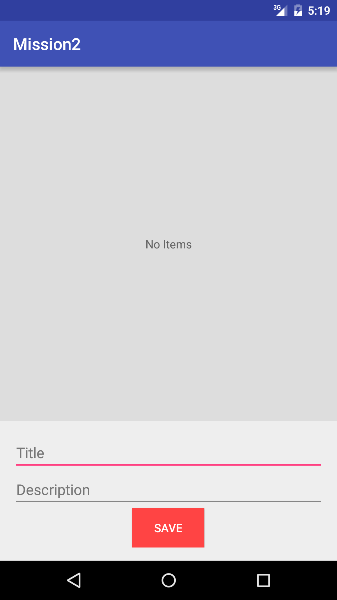
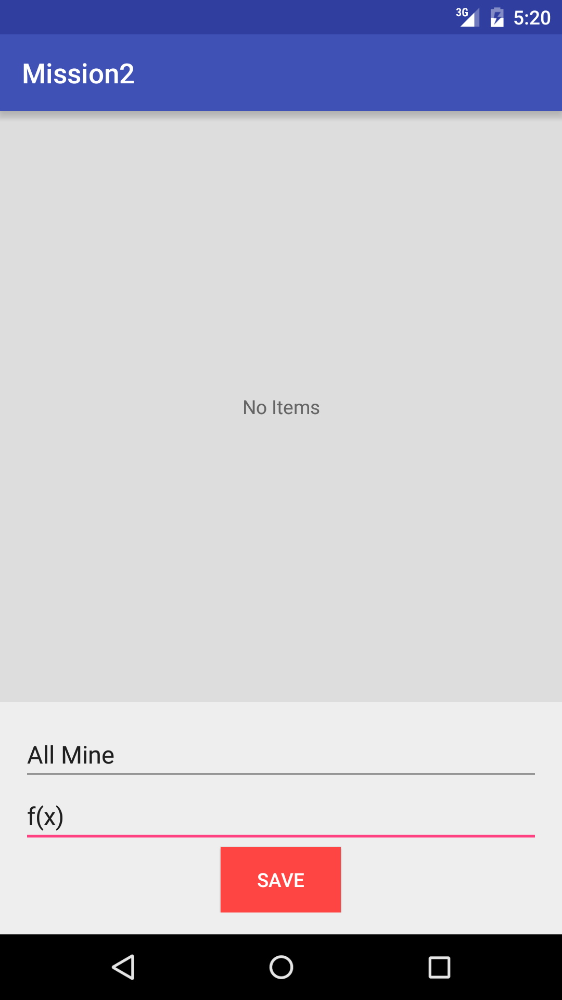
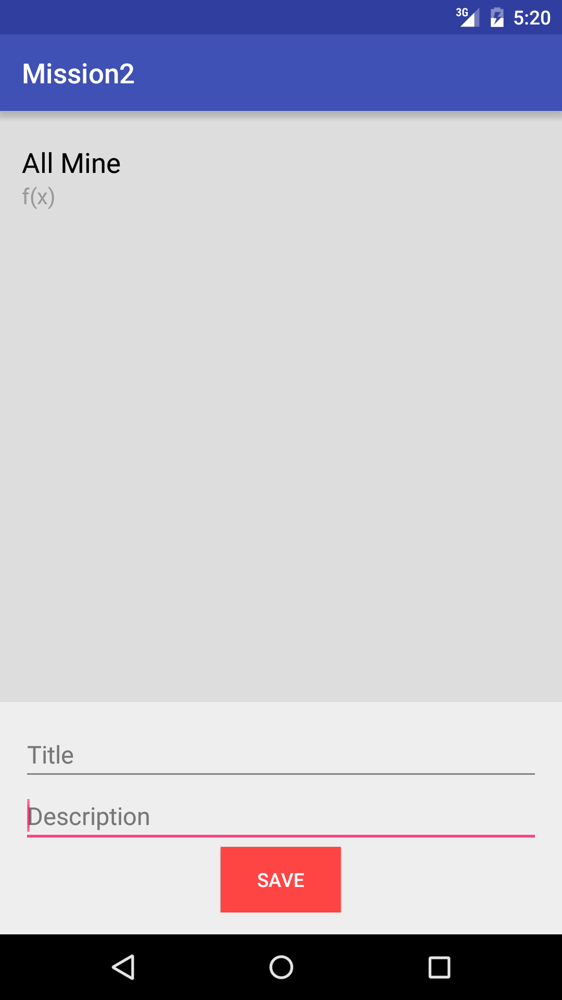
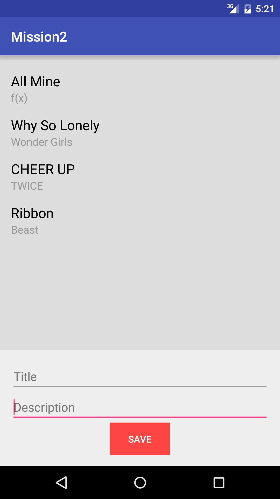
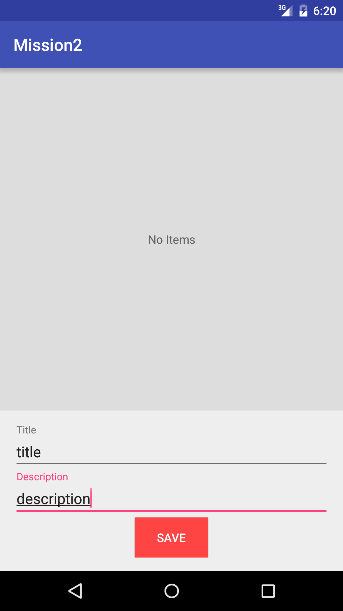

# Mission2
**Android ListView & Adapter Practice**

1. 두 EditText 작성 후 버튼을 누르면 상단의 ListView에 리스트 항목으로 보여줍니다.
  1. **(추가) EditText -> TextInputLayout 변경**
2. 아무것도 입력되지 않았을 때 - 화면에 "No Items" 텍스트 출력
3. 버튼 누르면 리스트에 등록된 후, EditText 초기화
4. **(추가)리스트 항목 누르면 세부 정보로 이동**(3번째 미션)
  1. 리스트 항목 누르면 세부 정보 Activity로 이동
  2. 상단 액션bar에 back 버튼 생성, 누르면 이전으로 돌아감 

**ScreenShots**

